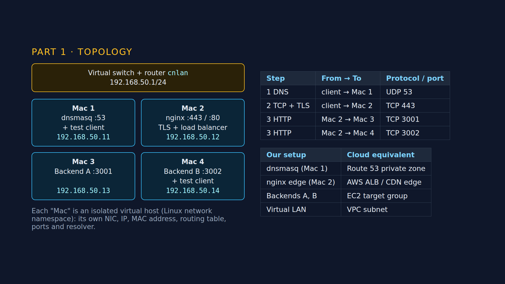
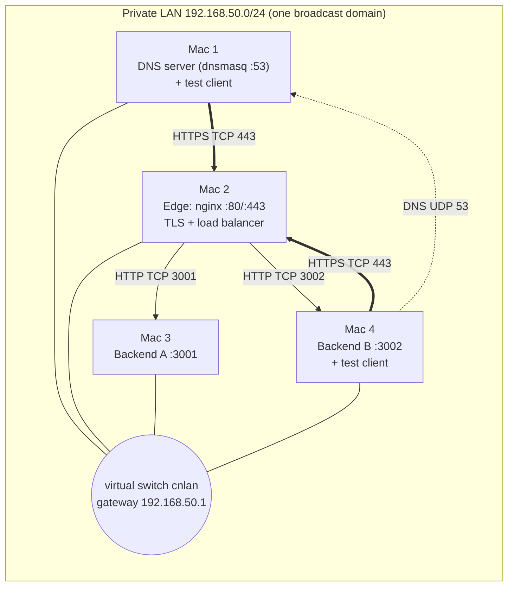
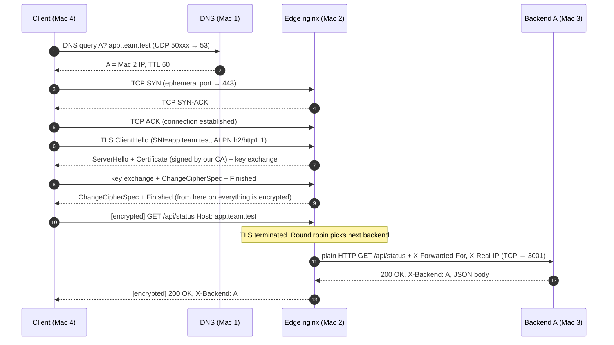

# Architecture Document: Phase 1

## 1. Network topology

**Infrastructure: Type 3 (virtual machines).** The four machines are virtual hosts created by `lab/virtual-lan.sh`. Each is an isolated Linux network namespace with its own network interface (`eth0`), IP address, MAC address, routing table, listening ports and `/etc/resolv.conf`, so the network sees four separate machines. All four plug into one virtual switch (the Linux bridge `cnlan`), which also holds the gateway address 192.168.50.1 and plays the role of the Wi-Fi router. Run any command "on" a machine with `lab/on.sh mac2 <command>`. The very same scripts and configs run unchanged on four physical Macs (Type 1).

All four machines join the same private LAN, so they share one subnet and one default gateway (the router). There's no routing between subnets, no NAT between our machines, and no cloud.

Physically every Mac talks to the router (a star topology). Logically, traffic follows the dashed and solid arrows: clients only ever talk to **Mac 1 (DNS)** and **Mac 2 (edge)**. Only the edge talks to the backends.

## 2. Machine roles and IP / service table

Fill in from `evidence/inventory/*.txt` (the `scripts/inventory.sh` output prints this exact row).

| Role | Hostname | Interface | IPv4 | Mask / prefix | Gateway | MAC address |
|---|---|---|---|---|---|---|
| Mac 1: DNS + client | mac1-dns | eth0 | 192.168.50.11 | 255.255.255.0 (/24) | 192.168.50.1 | 02:42:c0:a8:32:11 |
| Mac 2: Edge | mac2-edge | eth0 | 192.168.50.12 | 255.255.255.0 (/24) | 192.168.50.1 | 02:42:c0:a8:32:12 |
| Mac 3: Backend A | mac3-backend-a | eth0 | 192.168.50.13 | 255.255.255.0 (/24) | 192.168.50.1 | 02:42:c0:a8:32:13 |
| Mac 4: Backend B + client | mac4-backend-b | eth0 | 192.168.50.14 | 255.255.255.0 (/24) | 192.168.50.1 | 02:42:c0:a8:32:14 |

Raw output for each machine: `evidence/inventory/<hostname>.txt`. Ping matrix: `evidence/inventory/ping-*.txt`.

### Service map

| Machine | Service | Listens on | Protocol | Who connects to it |
|---|---|---|---|---|
| Mac 1 | dnsmasq | `MAC1_IP:53`, `127.0.0.1:53` | DNS over UDP (TCP for big answers) | Every client |
| Mac 2 | nginx | `*:80` | HTTP, only redirects to HTTPS and serves `/ca.crt` | Clients |
| Mac 2 | nginx | `*:443` | HTTPS (TLS 1.2/1.3, HTTP/1.1 + HTTP/2 via ALPN) | Clients |
| Mac 3 | backend A (`server.py`) | `0.0.0.0:3001` | Plain HTTP/1.1 | Only the edge |
| Mac 4 | backend B (`server.py`) | `0.0.0.0:3002` | Plain HTTP/1.1 | Only the edge |

### DNS records (Mac 1)

| Name | Type | Value | TTL |
|---|---|---|---|
| `app.team.test` | A | Mac 2 IP | 60 s |
| `api.team.test` | A | Mac 2 IP | 60 s |
| `mac1…mac4.team.test` | A | each Mac's IP | 60 s |
| anything else under `team.test` | | NXDOMAIN (we are authoritative, `local=/team.test/`) | |
| everything else (google.com …) | | forwarded to `1.1.1.1` | |

Both service names point at the **edge**, never at a backend. That's why clients never need to know backend IPs: the backends can move, scale or die, and the client still just asks for `app.team.test`.

## 3. Request flow, layer by layer

What happens when the client on Mac 4 runs `curl https://app.team.test/api/status`:

### Which layer does what

| Step | OSI layer | TCP/IP layer | Protocol | Ports | What it is used for |
|---|---|---|---|---|---|
| Name → IP | 7 Application | Application | DNS | client ephemeral → **UDP 53** | Find *where* the service is |
| Carry DNS | 4 Transport | Transport | UDP | | One question, one answer, no connection needed |
| Reliable byte stream | 4 Transport | Transport | TCP | client ephemeral → **TCP 443** | 3-way handshake, sequence/ack numbers, retransmission |
| Encryption + server identity | 5/6 Session/Presentation | (between Transport and Application) | TLS 1.2 / 1.3 | inside TCP 443 | Confidentiality, integrity, proving the server is really app.team.test |
| The request itself | 7 Application | Application | HTTP/1.1 or HTTP/2 | | GET, headers, status codes, caching |
| Getting between Macs | 3 Network | Internet | IPv4 | | Source/destination IP addresses on the same subnet |
| On the Wi-Fi | 2 Data link | Link | 802.11 / Ethernet frames, ARP | | MAC addresses, the router delivers the frame |
| Edge → backend | 7 + 4 | App + Transport | HTTP over TCP | edge ephemeral → **3001 / 3002** | A second, separate TCP connection. TLS has already ended. |

Notice that **two separate TCP connections** carry each request: client to edge (encrypted) and edge to backend (plain). The backend sees the edge's IP as its TCP peer, which is why nginx adds `X-Forwarded-For` / `X-Real-IP` so the backend still knows who the real client is.

## 4. Our setup vs the cloud

| Our component | What it does | Cloud equivalent |
|---|---|---|
| Mac 1 dnsmasq | Answers for a private zone, forwards the rest | AWS Route 53 private hosted zone, Cloud DNS |
| Mac 2 nginx | One public entry point, TLS termination, spreads load, health checks | AWS ALB / NLB, GCP HTTPS Load Balancer, CDN edge node (CloudFront) |
| Mac 3 / Mac 4 backends | Identical stateless app servers | EC2 instances / containers in a target group |
| Our local CA | Issues the server certificate that clients trust | AWS ACM / Let's Encrypt (publicly trusted CAs) |
| The Wi-Fi LAN | Private network between machines | VPC + subnet |
| `Cache-Control` / `ETag` | Lets clients and caches reuse responses | CDN caching (CloudFront, Cloudflare) |

## 5. Design choices

- **Round robin** (nginx default) because both backends are identical. `least_conn` would matter only if requests took very different amounts of time.
- **Passive health checks** (`max_fails=1 fail_timeout=10s` + `proxy_next_upstream`): if a backend refuses a connection, nginx retries the same request on the other one and skips the dead one for 10 s. The client never sees an error. (Active health checks are an nginx Plus feature.)
- **TLS terminates at the edge.** The backends stay simple HTTP, and there's one place to manage certificates. The trade-off is that the edge→backend hop is plaintext on the LAN (fine for a private network; production would use mTLS or a private VPC).
- **Same content = same ETag on both backends.** `/api/info` hashes identical bytes on A and B, so a conditional request gets a 304 no matter which backend the load balancer picks.
- **Single point of failure:** the edge (Mac 2) and the DNS server (Mac 1). Phase 2 adds a backup resolver and a standby edge.
